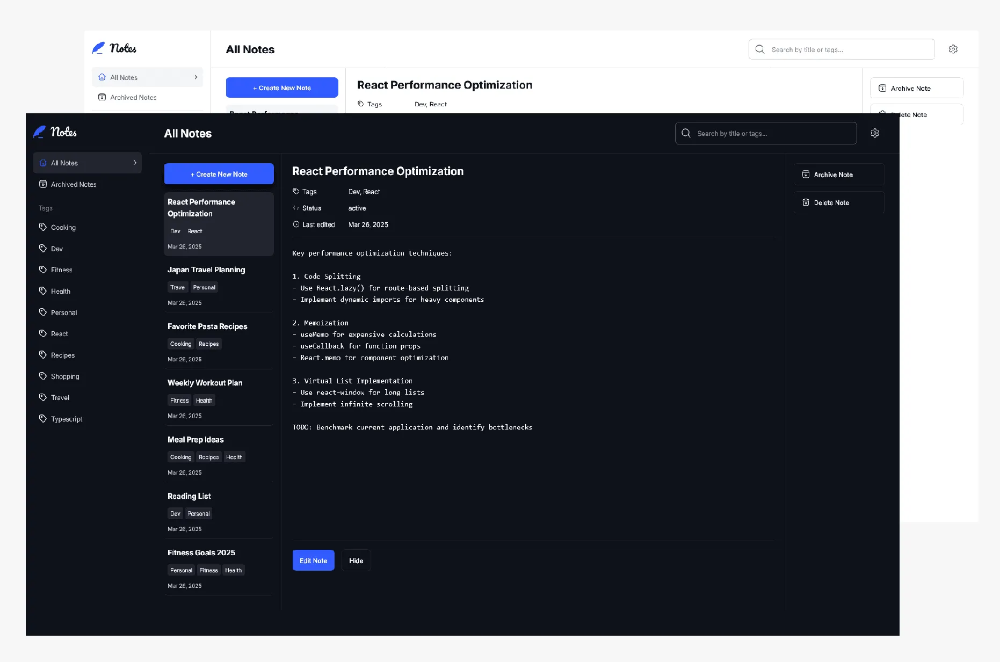

# Note Flow note-taking app

## Overview

Convenient and practical web application for writing down notes and information and arranging them into different categories. It allows easily find the necessary note among hundreds in seconds. No more creating dozens of files for separate notes that you may need to use later in the future at some point. 

This is a single page full-stack application with all the features, including login, authentication, password reset, email notifications, language switch (there are French, Russian and English versions), font switch and theme switch. Your account is protected by Laravel backend, so rest assured that your notes will be accessible to only you alone.

### Screenshot

### Links

[Link to the app](https://noteflow.online/)

## My process

### Built with

- Semantic HTML5 markup
- TypeScript
- Tailwind CSS
- React
- Laravel
- Inertia
- Mobile-first workflow

## Author

- Website - [My web portfolio](https://bespokewebsites.pro/)
